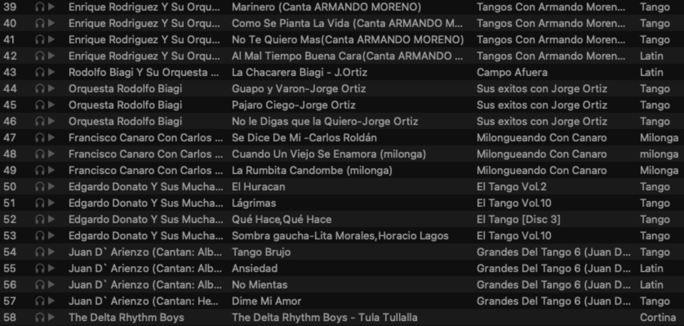
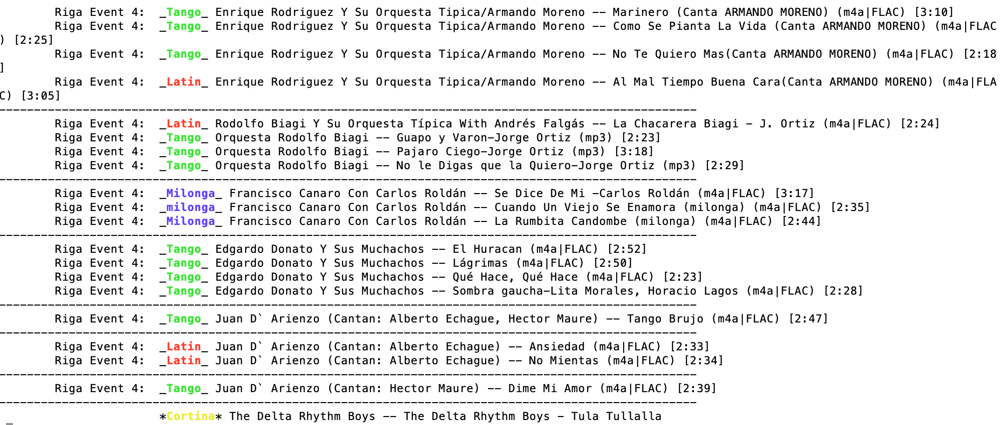
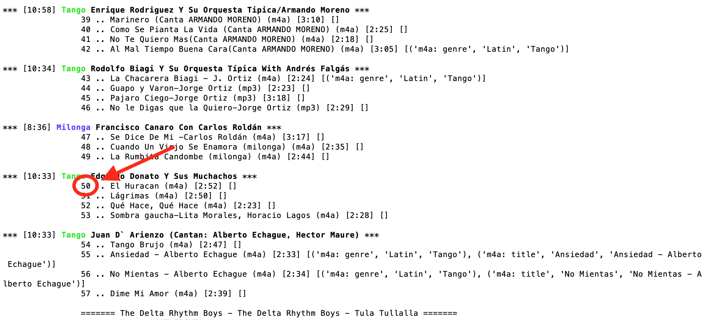
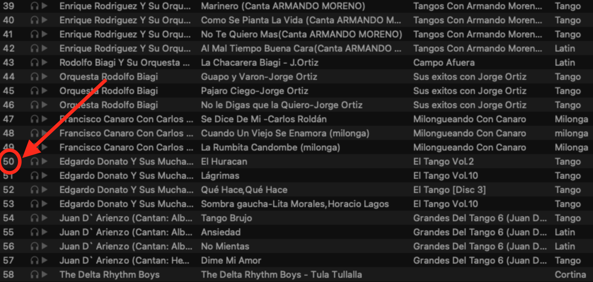
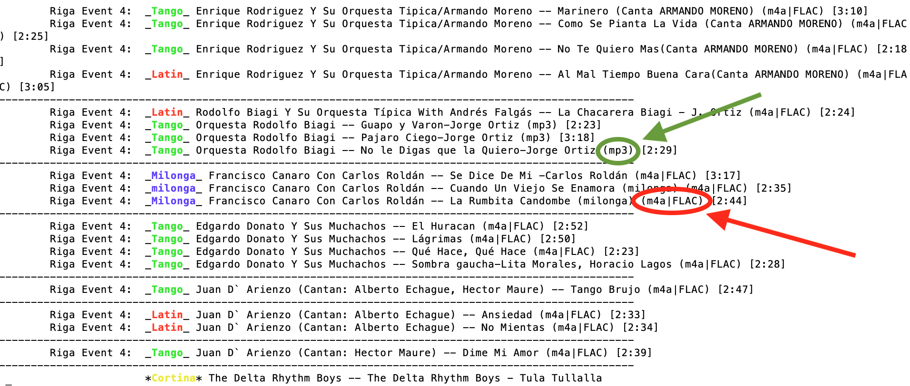
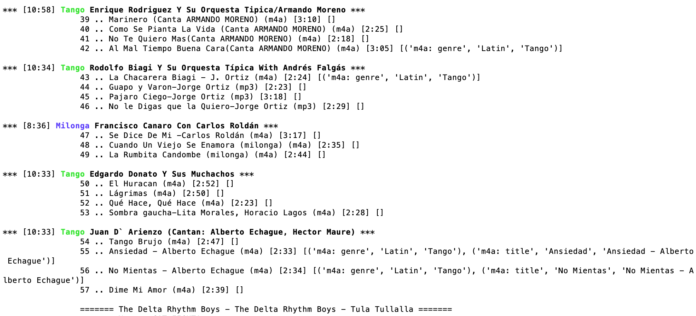

# Tango Library

> Argentine tango is a musical genre and accompanying social dance originating at the end of the 19th century in the suburbs of Buenos Aires and Montevideo.

## Introduction

My collection of tango music consists of some 20,000 audio files.
As a DJ I need to find the right files in order to play them. For that I depend 
first on metadata on the files.

The present project is about cleaning up and enriching the metadata I have on my
collection of tango music.

## Data

### Sources & formats

My tango music comes from:
* My own CDs which I ripped: m4a (iTunes), flac formats.
* Music bought online: m4a
* Educational tango music from a website: mp3
* Converted from youtube: mp3
* Some WAV files

### Metadata

Metadata comes from:
* CDDB and MusicBrainz (upon ripping CDs)
* Included metadata in mp3 files
* Derived from file names
* Manual corrections or additions.

Note that:
* Sometimes the metadata is completely wrong, e.g. wrong orchestra and song title
* Somewhat wrong, e.g. spelling errors like 'Alberto Echague' instead of 'Alberto Echagüe'
* Non-standard, e.g. both 'Miguel Caló' and 'Caló, Miguel' are used 
* Incomplete: e.g. 'Latin' for genre or 'Miguel Caló' for 'Orquesta Miguel Caló'
* Overcomplete: e.g. 'Juan D'Arienzo & Alberto Echagüe', 'Juan D'Arienzo - Canta- Hector Maure', and 
  'Juan D` Arienzo (Cantan: Alberto Echague) (Singer added)
  

### Enriched data

Music players are typically oriented towards a sequence of songs. 

Tango as played at dance events has more structure:
* There are three genres having different rhythms: _tango_, _vals_, and _milonga_
* Music is played in blocks consisting of 4 tango songs, 3 or 4 vals songs, or 3 milonga songs
* Between each block circa one minute of non-tango is played to demarcate the separation 
  between blocks, such a fragment is called a _cortina_ (= curtain)
* The blocks are played in a standard sequence: tango - tango - vals - tango - tango - milonga - and again

Terminology for "blocks" of songs:
> _Tanda_ - sequence of three or four songs of the same genre

A DJ is typically interested in _tandas_ of associated songs in sequence, rather than in individual songs. Problem is that
standard music playing programs don't support such blocks as objects. We want to enrich the data to encompass
the tanda level.

As source data for tandas I have only playlists containing lists of songs where tandas
can be identified from genres of the sequences of songs.

## Systems

### Sources

My playlists are stored in two different systems:
1. iTunes: legacy XML file containing playlists
2. Mixxx: my currently used DJ system which uses an sqlite3 database as a backend

My code reads data from both systems.

### Target

iTunes is no longer suitable for DJ'ing and iTunes data is to be phased out. Any modifications
and future data sources should be:
1. Audiofiles themselves ("gold standard")
2. Mixxx: update standard Mixxx tables
3. Additional source: can be an external file, another database, or added tables in the sqlite3 database that Mixxx uses.

## Goals

1. Quickly search for tandas used in the past, that is, which are part of playlists
2. Make such tandas accessible for copy-pasting to new playlists in Mixxx
3. Clean up music collection so that only the highest quality version of a song remains
4. Normalise metadata
5. Categorisation:
    * Orchestra leaders
    * Years/periods
    * Singers
    * Instrumental / with singing
6. _tandas_ as first class objects: storage, access, labeling with their own metadata

### 1. Search for tandas

Use cases:

As a DJ I want to see any and all tandas:
* Containing a specific song
* Of an orchestra of a specific genre, e.g. _Orquesta Miguel Caló_ intersecting with _Vals_

Solution:
* Convert playlists in textual format as a single file, one line per song
* Mark songs for their genre
* Identify groups of songs, that is, _tandas_.

Practical problems:
* Many genre fields were not filled in correctly, e.g. _Latin_ for _Vals_
* Historical playlists were not necessarily structured well, so genres could not be derived from
counting songs in a playlist
  
I addressed this by generating the textual report, adding warning signs where genre fields were
incomplete, and then manually fixing the metadata.

Mixxx view

Generated text view
 "Riga Event 4 - Text version"]

To search, the generated text can be viewed in `less` and searched using that application.

### 2. Make tandas accessible for copy-pasting

To copy a tanda from an old playlist to a newly created playlist, we need to work inside
Mixxx.

Process:
1. Search for tanda in text using `less`
2. Identify name of playlist (this is displayed in the text as a header somewhere above the tanda)
3. Open the playlist of that name in Mixxx
4. Search for the songs of the tanda, mark them, and copy them to the new playlist

Note that searching for songs of a tanda is non-trivial. 
Using the "search-in-playlist" in Mixxx will just give one song, rather than the tanda.
What remains is browsing, but that is hard in practice as there is no demarcation of tandas.

To make it easier to look up songs in a playlist, their `ranking` in the playlist
is added to the textual report.

In the report the ranking in the playlist is added:

Browsing the playlist, we can scroll straight to the ranking index:

Having found the song in the context of its tanda, we can copy the tanda to another playlist.

### 3. Clean up library so only the highest quality versions remain

There are several reasons for having ended up with different versions of a song, e.g.:
* It comes in through different anthologies, e.g. a compilation CD with songs from different orchestras or 
  an mp3 that is part of a collection of all songs of one orchestra. 
* One version is ripped in Apple m4a format (mpeg4), another ripped in lossless flac format.

Any version might have ended up in a playlist, which means that removing it without relinking to
another version will damage the playlist.

Step 1:

To improve the quality of playlists, I have added an indicator for the availability of a lossless 
flac version to the text reports on the filetype. That I used to manually fix the playlists.

In the image:
* Green: filetype for a song
* Red: filetype for a song and indicator that a flac version is also available.

    

Step 2:

Automatically remove lower quality version from the library which are not linked to any playlist.

### 4. Normalise metadata

* Single spelling for genres
* Single spelling for orchestras and singers

Examples for orchestras:
* Caló, Miguel
* Miguel Caló
* Orquesta Miguel Calo
* Miguel Caló feat. Raul Iriarte
* Miguel Caló feat. Raúl Iriarte
* Alberto Podesta & Orquesta & Miguel Calo

Note that there is no necessarily a single name for the orchestra an
orchestra leader works with. E.g.
* Carlos Di Sarli Y Su Orquesta Típica
* Carlos Di Sarli y su Sexteto

The orchestra and the sexteto are actually different and these designations contain 
relevant information. We want to _categorise_ them as being of orchestra leader Di Sarli, 
but we don't want to lose the type of orchestra.

### 5. Categorisation

Different categories help DJs to group songs, e.g. 
different periods, e.g. 1930s and 1950s, are typically not mixed.
Neither are instrumental songs and songs with singing.

* Orchestra leaders
* Years/periods
* Singers
* Instrumental / with singing

### 6. Tandas as first class objects

In the picture below we see a playlist with:
* A single designation of the orchestra per tanda, 
rather than being repeated per song
* Duration for the whole tanda (sum of the durations of all songs in the tanda)

